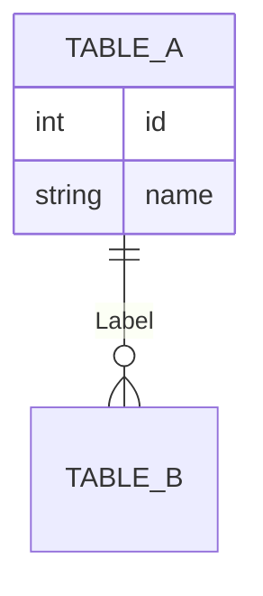

# Pattern: Mermaid Syntax

## ER Diagram Structure

## Cardinality Meanings
- `0{`: Zero or more
- `1{`: One or more
- `o{`: Zero or more (optional)
- `||`: Exactly one

## Best Practices for WoW Maps
- **Centralize Spells**: In WoW data, the `Spell` table is often the central anchor.
- **Color Coding**: (If supported by renderer) Use different styles for different expansion data.
- **Node attributes**: Only include columns that are actually part of a confirmed mapping to save space.
