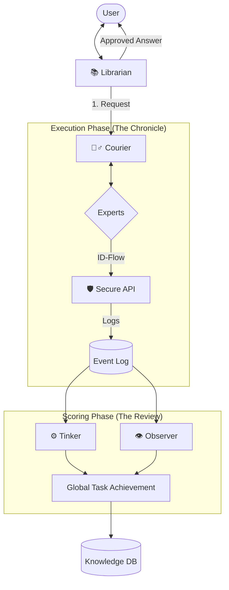

# 🏗️ System Architecture & Flow

[⬅️ Back to Home](../Home.md)

The Library uses a **Hub-and-Spoke Orchestration** model with a **Secure API Layer**.

## The High-Level Flow

## Core Architectural Principles

1. **ID-Communication**: Agents only pass Task and Event IDs. They fetch their own context via the API.
2. **Information Isolation**: No agent talks directly to another. Everything goes through the Courier.
3. **State Transparency**: The `current_location` in the Task table ensures the system knows exactly where a request is at any given moment.
4. **Middleware Strategy**: The Courier can inject Sentinel (Sanitization) or Critic steps dynamically into the queue.
5. **Retrospective Wisdom**: Judgment happens only _after_ the Librarian presents the answer, evaluating the entire journey.
