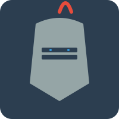

# 🛡️ The Sentinel

[⬅️ Back to Home](../Home.md)

The Sentinel is the system's "Filter and Shield." Their job is to ensure that only clean, safe, and valid data progresses to the final stages.

## Responsibilities

- **Sanitization**: Removes HTML tags, control characters, and "junk" from database strings.
- **Validation**: Checks the integrity of Row IDs and ensure they actually exist.
- **Security**: Scans the Courier's routing decisions for logic loops or unauthorized access attempts.

## API Interface

- **Permissions**: Read (Event Context), Write (Validation Flags).
- **Primary Tool**: `library_set_event_quality(event_id, rating)`.
